# Linux Fundamentals Assignment-01

In this assignment, we need to explore some fundamentals command for linux.

## File System Navigation
1. List the contents of the home directory.
    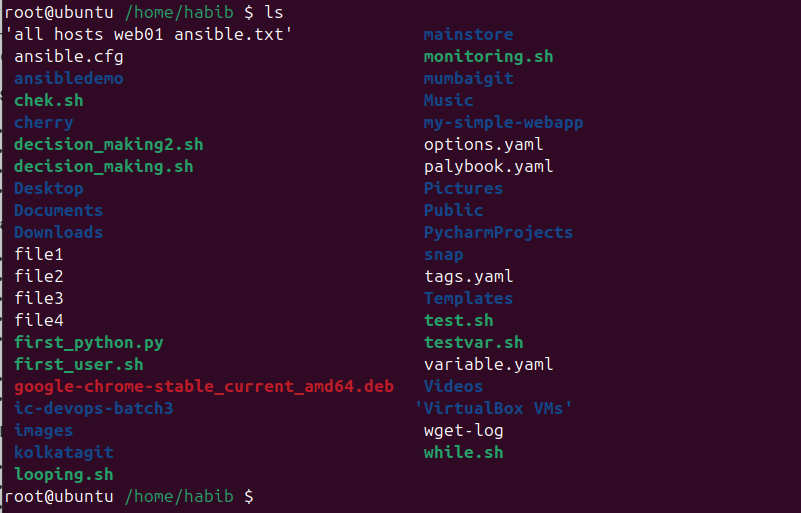
2. Change the current directory to `/var/log` and list its contents.
    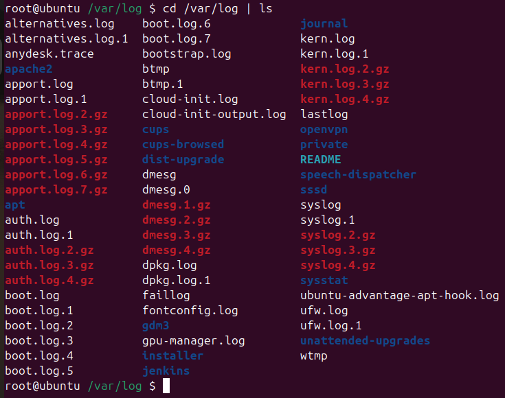
3. Find and display the path to the bash executable.
    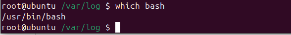
4. Find the current shell.
    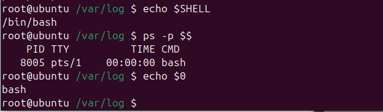

## File and Directory Operations
1. Create `linux_fundamentals` directory in the home directory.
    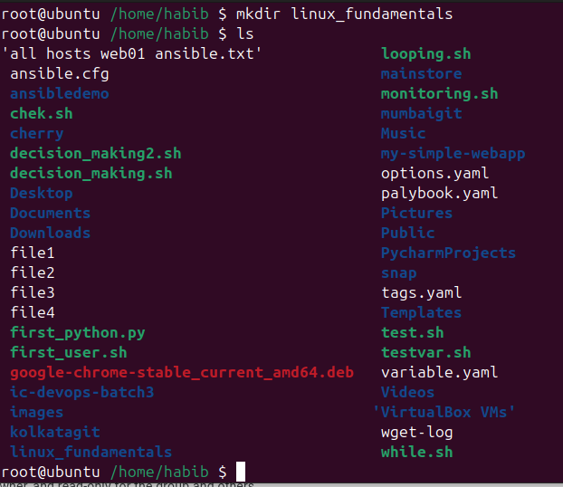
2. Create a subdirectory `scripts` inside `linux_fundamentals`.
    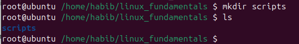
3. Create `example.txt` file inside the `linux_fundamentals` directory.
    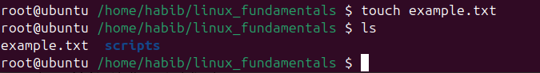
4. Copy `example.txt` to `scripts` directory.
   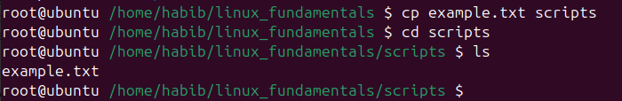
5. Move `example.txt` from `linux_fundamentals` to `linux_fundamentals/backup.permission`
   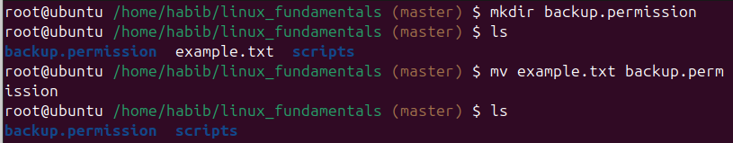
## File Modification
1. Create a file named `example.txt` in your home directory.
    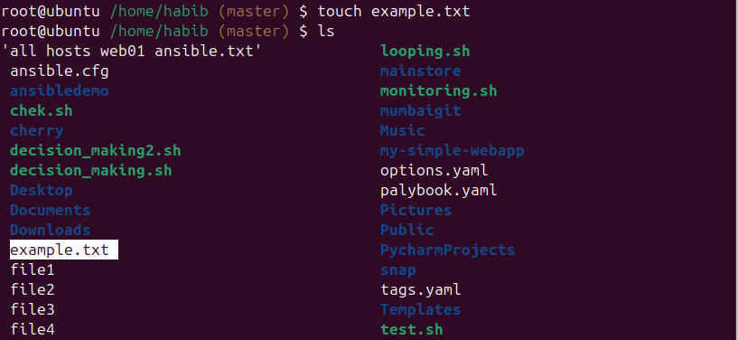
2. Change the owner of `example.txt` to a user named student
    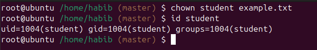
3. Change the group of `example.txt` to a group named students.
    
4. Verify the changes using appropriate commands.
    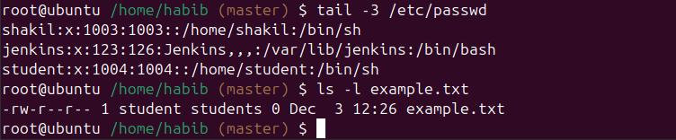
## Ownership
1. Create a directory named `project` in your home directory.
    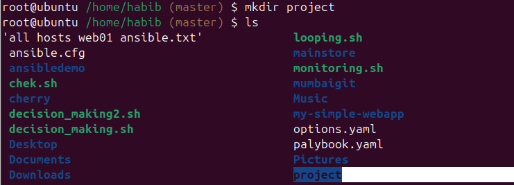
2. Create a file named `report.txt` inside the `project` directory.
   
3. Set the permissions of `report.txt` to read and write for the owner, and read-only for the group and others.
    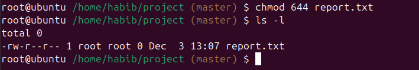
4. Set the permissions of the `project` directory to read, write, and execute for the owner, and read and execute for the group and others
    
    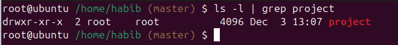
5. Verify the changes using appropriate commands.
    
 
## User add/modify
1. Create a new user named `developer`.
2. Set the home directory of the user `developer` to `/home/developer_home`.
3. Assign the shell `/bin/sh` to the user developer.
    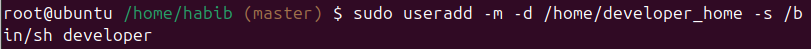
4. Verify the new user's information.
    
5. Change the username of the user `developer` to `devuser`.
    
6. Add `devuser` to a group named `devgroup`.
    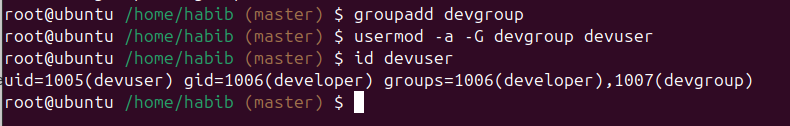
7. Set the password of `devuser` to `devpass`.
    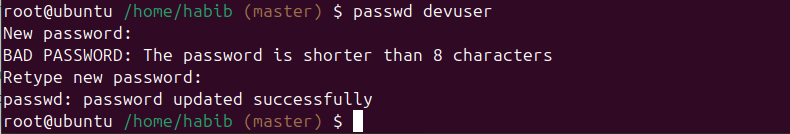
8. Verify the changes made to the user.
    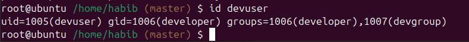
    
##Hard/Soft Link
1. Create a file named `original.txt` in your home directory.
    
2. Create a symbolic link named `softlink.txt` pointing to `original.txt`.
    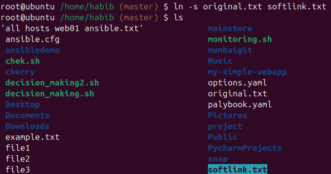
3. Verify the symbolic link and ensure it points to the correct file.
    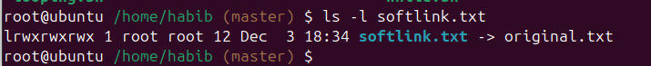
4. Delete the original file `original.txt` and observe the status of the symbolic link.
    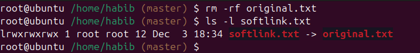
5. Create a file named `datafile.txt` in your home directory.
    
6. Create a hard link named `hardlink.txt` pointing to `datafile.txt`.
    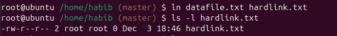
7. Verify the hard link and ensure it correctly points to the file.
    
8. Check the inode of both `datafile.txt` and `hardlink.txt`
    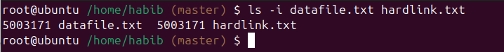
9. Delete the original file `datafile.txt` and observe the status of the hard link.
    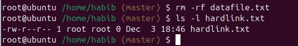
10. Find all .txt files in your home directory. ( use find command. Run find --help for usage)
    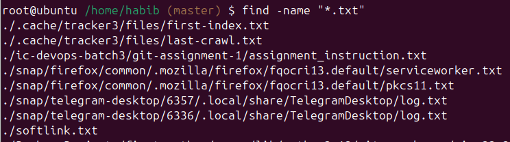
## Package Installation
1. Update repo cache using apt.
    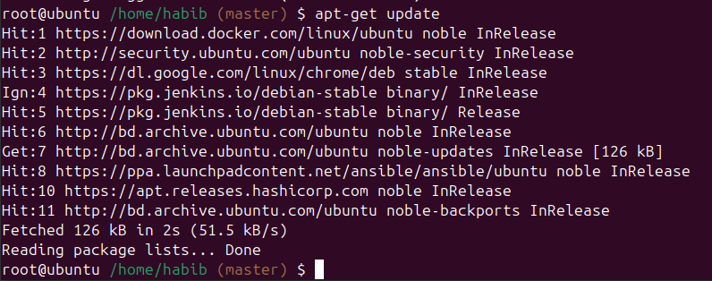
2. Install the package `tree`.
    
    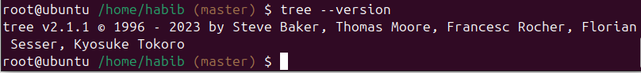
3. Install gcloud CLI tool.
    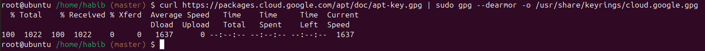
    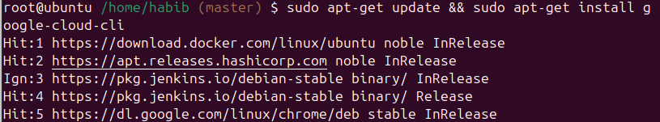
    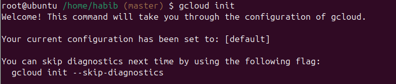

